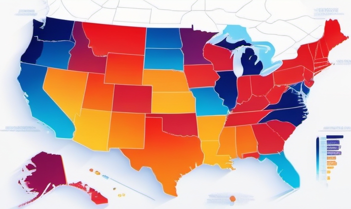
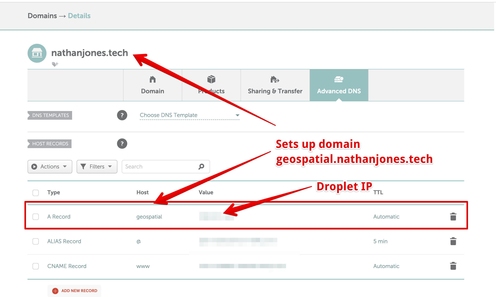

<p align="center">
  <a href="" rel="noopener">
  <!-- Use the image stored in this relative path `images/logo.png` as the src attribute of the img tag. -->
  </a>
</p>

<h3 align="center">US Census Interactive GIS Application</h3>

<div align="center">

[](/LICENSE)

</div>

---

<p align="center"> Explore a number of housing metrics from US Census data in an interactive GIS application
    <br> 
</p>

## 📝 Table of Contents

- [About](#about)
- [Getting Started](#getting_started)
- [Running the App Locally](#usage)
- [Deployment](#deployment)
- [TODO](#todo)

## 🧐 About <a name = "about"></a>

This project is an interactive GIS application that allows users to explore a number of housing metrics from US Census data. The app is built using [Streamlit](https://streamlit.io/) and [Deck.gl](https://deck.gl/). The application uses a PostgreSQL backend to store the data. The data is sourced from the [US Census Bureau](https://www.census.gov/).


## 🏁 Getting Started <a name = "getting_started"></a>

These instructions will get you a copy of the project up and running on your local machine for development and testing purposes. See [deployment](#deployment) for notes on how to deploy the project on a live system.

### Prerequisites

Docker ([Docker Desktop comes with Docker](https://www.docker.com/products/docker-desktop/))

## 🏃 Running the App <a name = "usage"></a>

Clone the repoisitory
```
git clone https://github.com/nathanjones4323/geospatial-portfolio-app.git
```

Navigate to the app's directory
```
cd geospatial-portfolio-app
```

Run the following in your terminal:
```
docker-compose up -d
```

> **If you need to rebuild and run the container run this command**

```
docker-compose up --force-recreate --build -d && docker image prune -f
```

If this is the first time you are running the app, it will take a few minutes for the data pipelines to finish running. You can check the status of the pipelines by running the following command:

```bash
docker-compose logs -f
```

Once the pipelines have finished running (or if you are restarting the app), you can access the Streamlit UI at http://localhost:8501

## 🚀 Deployment <a name = "deployment"></a>

This app is deployed on Digital Ocean using a droplet and their managed PostgreSQL offering.

Here are the steps to deploy the app on Digtial Ocean after you have created an account:

*  Install the Digital Ocean CLI
```bash
brew install doctl
```

*  Login with the Digital Ocean CLI
```bash
doctl auth init
```

*  Create a managed PostgreSQL database
```bash
doctl databases create portfolio --engine pg --region sfo2 --size db-s-1vcpu-1gb
```

*  Generate an SSH key
```bash
ssh-keygen
```

*  Add the SSH key to your Digital Ocean account
```bash
doctl compute ssh-key import do_ssh --public-key-file ~/.ssh/id_rsa.pub
```


*  Create a droplet
```bash
doctl compute droplet create geospatial-streamlit-portfolio --tag-names portfolio --image ubuntu-23-10-x64 --region sfo2 --size s-2vcpu-2gb --ssh-keys ${ssh_key_md5_fingerprint} --enable-ipv6 --enable-monitoring --enable-private-networking
```
Where `${ssh_key_md5_fingerprint}` is the MD5 fingerprint of the SSH key you created in the previous step. You can find this by running the following command:
```bash
doctl compute ssh-key list
```

*  SSH into the droplet
```bash
doctl compute ssh geospatial-streamlit-portfolio
```

*  Install docker-compose
```bash
sudo apt update && sudo apt install docker-compose && docker-compose --version
```

*  Clone the repository
```bash
git clone https://github.com/nathanjones4323/geospatial-portfolio-app.git
```

*  Navigate to the app's directory
```bash
cd geospatial-portfolio-app
```

*  Create a `.env` file inside of `./data-pipelines/census`
```bash
cd data-pipelines/census && nano .env
```

*  Paste in the following environment variables into the `.env` file
```bash
POSTGRES_USER=
POSTGRES_PASSWORD=
POSTGRES_DB=
POSTGRES_PORT=
POSTGRES_HOST=
US_CENSUS_CROSSWALK_API_KEY=
```

Where `POSTGRES_USER`, `POSTGRES_PASSWORD`, `POSTGRES_DB`, `POSTGRES_PORT`, and `POSTGRES_HOST` are the same values you used when creating the managed PostgreSQL database. `US_CENSUS_CROSSWALK_API_KEY` is the API key you can get from the [US Census Bureau](https://api.census.gov/data/key_signup.html).

* Run the data pipelines on your **local machine** to populate the database

* Run the Streamlit UI
```bash
cd && cd geospatial-portfolio-app && docker compose up -d --build streamlit
```

*  Install and configure nginx
```bash
sudo apt install nginx &&
sudo ufw allow "Nginx Full" &&
sudo nano /etc/nginx/sites-available/geospatial-portfolio-app.conf
```

*  Paste in the following configuration into the `geospatial-portfolio-app.conf` file
```bash
server { listen 80; listen [::]:80; server_name ${dropet_ipv4_address};

    access_log  /var/log/nginx/geospatial-portfolio-app.access.log;
    error_log   /var/log/nginx/geospatial-portfolio-app.error.log;

    location / {
      proxy_http_version 1.1;
      proxy_set_header Upgrade $http_upgrade;
      proxy_set_header Connection "upgrade";
      proxy_set_header X-Forwarded-For $proxy_add_x_forwarded_for;
      proxy_set_header X-Real-IP $remote_addr;
      proxy_set_header X-Forwarded-Host $host;
      proxy_set_header X-Forwarded-Proto https;
      proxy_pass http://localhost:8501;
  }
}

server {
    listen       80;
    listen       [::]:80;
    server_name  ${your_subdomain}.${your_domain};

    access_log  /var/log/nginx/geospatial-portfolio-app.access.log;
    error_log   /var/log/nginx/geospatial-portfolio-app.error.log;

    location / {
      proxy_http_version 1.1;
      proxy_set_header Upgrade $http_upgrade;
      proxy_set_header Connection "upgrade";
      proxy_set_header X-Forwarded-For $proxy_add_x_forwarded_for;
      proxy_set_header X-Real-IP $remote_addr;
      proxy_set_header X-Forwarded-Host $host;
      proxy_set_header X-Forwarded-Proto https;
      proxy_pass http://localhost:8501;
  }
}
```
Replace `${dropet_ipv4_address}` with the IP address of your droplet and `${your_subdomain}.${your_domain}` with the subdomain and domain you want to use for your app.

`${your_subdomain}.${your_domain}` is the URL you will use to access the app instead of the droplet IP address.

Hit `control + O` and then `ENTER` to save. Press `control + X` to exit

Link the configuration file `sudo ln -s /etc/nginx/sites-available/geospatial-portfolio-app.conf /etc/nginx/sites-enabled/`

Check that the config file syntax is correct `sudo nginx -t`

Reload nginx with new config `sudo systemctl reload nginx.service`

Check that app is able to be opened now in your browser at `http://{droplet_ip_address}:8501 & http://{your_subdomain}.{your_domain}`

*You need to have a subdomain set up already for your application to work. You can do this by going to your domain registrar and adding an A record for your subdomain that points to your droplet IP address.*



* Setting up your domain name with Digital Ocean

```bash
doctl compute domain create {your_domain} --ip-address {droplet_ip_address}
```

*  Setting up your subdomain name with Digital Ocean

Follow the instructions [here](https://docs.digitalocean.com/products/networking/dns/how-to/add-subdomain/) to set up your subdomain with Digital Ocean.

Follow the instructions for common domain registrars [here](https://docs.digitalocean.com/products/networking/dns/getting-started/dns-registrars/) to set up your subdomain with your domain registrar.

*  Installing Certbot and Setting Up TLS Certificates (HTTPS instead of HTTP)

```bash
sudo apt install certbot python3-certbot-nginx &&
sudo certbot --nginx -d ${your_subdomain}.${your_domain}
```

Hit `control + d` to exit droplets and end ssh session


<!-- #### Push the containers to Docker Hub (do this for data pipelines and Streamlit app)

Login to Docker

```
docker login
```

Build the containers

```
docker build -t {image_name}:$(git rev-parse --short HEAD) . --platform linux/amd64

docker build -t {image_name}:$(git rev-parse --short HEAD) . --platform linux/amd64
docker run pipelines . --platform linux/amd64
```

Tag the containers

```
docker tag {image_name}:$(git rev-parse --short HEAD) {docker_hub_username}/{image_name}:$(git rev-parse --short HEAD)
```

Push the containers to Docker Hub

```
docker push {docker_hub_username}/{image_name}:$(git rev-parse --short HEAD)
``` -->


## 🗒️ TODO <a name = "todo"></a>

### In Progress

- [ ] Add `Getting Started` section to home page
- [ ] Add `Tutorials` section to home page

### Future

- [ ] Fix truncating column name error ==> Postgres can only handle 63 characters for column names and this is causing duplicate column names
  - For now, just filter for a subset of columns in the data pipelines
- [ ] Add query parameters so users can share links to specific views of the app
- [ ] Make a tutorial on how to use the app
- [ ] Speed up the data pipelines using threading
- [ ] Clean up Dockerfiles and .env files ==> shouldn't have to specify the same environment variables in multiple places
- [ ] Make a function for adding a new metric
  - Current process:
    - Find the truncated column name for the metric using `standardize_column_name` from `transform.py`
    - Add the metric internal name (and rename if neeed) to filter from data pipeline in `run_acs_2021_cbsa_pipeline` and `run_acs_2021_zcta_pipeline` from `pipelines.py`
    - Add mapping inside of `get_metric_internal_name` from `utils.py` using the metric display name as the key and the internal name as the values
    - Add the metric internal name inside of `queries.py`
    - Define metric display name inside of the `options` for the multiselect widget in `siebar.py`

  #### Notes

  - [ ] Make Census GPT 
    - [ ] Store all of the census data in vector DB
    - [ ] Do Q/A over the data with LLM (ex: What is the most expensive Metro Area to rent in?)
    - [ ] Use the vector DB to create the maps
      - [ ] Make the LLM call the mapping functions